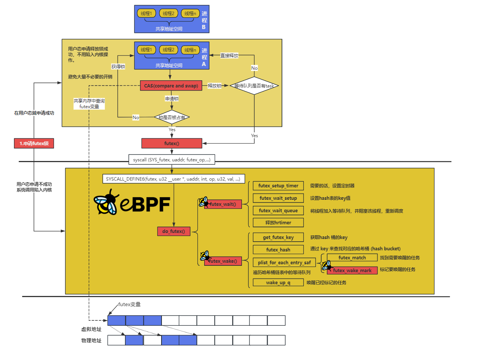

# 并发与同步内核学习
本系列文章将介绍在内核中是如何实现并发与同步的，介绍相关机制、在Linux6.5对应部分的实现方式（源码分析）、以及如何通过eBPF去获取到相关的内核数据（实践示例）
本系列文章主要分为以下几个模块：
* 1.初识并发同步机制
* 2.内核中的同步机制详细介绍（包含源码分析）
    
    * 2.1 原子操作及内存屏障
    * 2.2 非阻塞锁；
    * 2.3 阻塞锁；
* 3.案例分析

## 1 初识并发同步机制

## 2 内核中的同步机制详细介绍（包含源码分析）

### 2.1 原子操作及内存屏障

### 2.2 非阻塞锁

### 2.3 阻塞锁
阻塞锁是一种线程在无法立即获取锁时会进入等待（阻塞）状态的锁类型。这意味着，如果某个线程尝试获取一个已经被其他线程占用的锁，当前线程会被挂起，直到该锁被释放为止。
特点：
* 等待机制：线程会进入“阻塞”状态，等待其他线程释放锁。操作系统会将阻塞的线程调度出去，直到该锁可用。
* CPU资源占用：阻塞锁在等待时不会占用 CPU 资源，因为操作系统会将阻塞线程置于休眠状态，直到锁可用。
* 典型应用：常见的阻塞锁包括 mutex（互斥锁）、读写锁 等。它们适用于线程数较多、且需要长时间等待锁的场景。

本小节将围绕内核中两个常见的阻塞锁mutex、futex锁进行介绍及源码分析
#### 2.3.1 mutex

#### 2.3.2 futex锁
在学习futex锁时，参考了大量优秀的博客及论文：
* [openEuler社区/linux--futex原理分析](https://www.openeuler.org/zh/blog/wangshuo/Linux_Futex_Principle_Analysis/Linux_Futex_Principle_Analysis.html)
* [linux锁实现之内核futex](https://pzh2386034.github.io/Black-Jack/pthread/2020/02/15/linux%E9%94%81%E5%AE%9E%E7%8E%B0-futex%E5%86%85%E6%A0%B8%E5%AE%9E%E7%8E%B0/)
* [futex](https://www.cnblogs.com/studywithallofyou/p/13140416.html)

futex锁的全称是Fast Userspace muTexes ，即快速用户空间互斥锁，我们简称其为快锁。
一个futex可以认定为一块共有内存，在进程或线程之间是共享的。在一个单进程多线程中，由于所有线程共享同一个进程的地址空间，所以所有线程均可以访问futex变量；在多进程情况下，同步的进程间通过mmap共享一段内存（物理内存），所有的进程便可以在用户态访问这段内存；当进程尝试进入互斥区或者退出互斥区的时候，先去查看共享内存中的futex变量，如果没有竞争发生，则只修改futex,而不 用再执行系统调用了。当通过访问futex变量告诉进程有竞争发生，则还是得执行系统调用去完成相应的处理(wait 或者 wake up)。简单的说，futex就是通过在用户态的检查，如果了解到没有竞争就不用陷入内核了，大大提高了low-contention时候的效率。

用一句话介绍快锁机制（futex机制）：用户态和内核态共同合作完成的锁，在用户态尝试获得futex锁，若获取成功，则不用陷入内核；若在用户态获取快锁失败，则线程需要下CPU进入阻塞态，通过futex()触发系统调用陷入内核，在内核中实现阻塞线程或进程；

详细的流程如下：

当**用户态线程请求锁**时，先在用户态进行锁状态的判断维护，若此时不产生锁的竞争，则直接在用户态进行上锁返回；反之，则需要进行线程的挂起操作，通过Futex系统调用请求内核介入来挂起线程，并维护阻塞队列。

当**用户态线程释放锁**时，先在用户态进行锁状态的判断维护，若此时没有其他线程被该锁阻塞，则直接在用户态进行解锁返回；反之，则需要进行阻塞线程的唤醒操作，通过Futex系统调用请求内核介入来唤醒阻塞队列中的线程。

流程可参考以下这张图：
